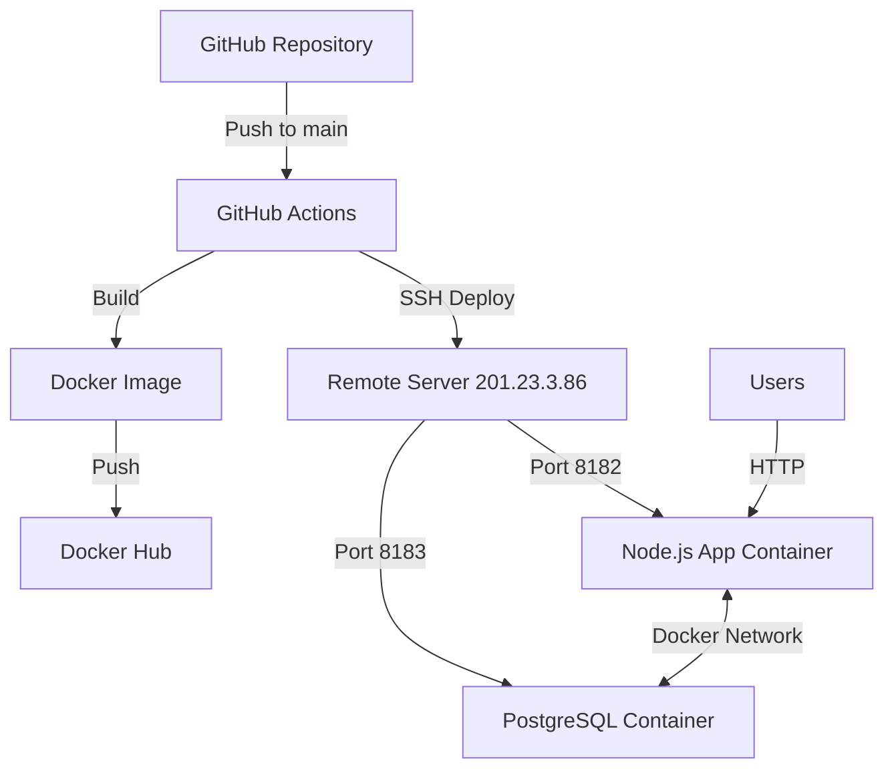

# ✨ Gerenciador de Tarefas - Deploy Automatizado

<div align="center">


**Uma aplicação web moderna para gerenciamento de tarefas com deploy automatizado**

[🌐 **Ver Demo**](http://201.23.3.86:8182) • [📖 **Documentação**](#-documentação) • [🚀 **Deploy**](#-deploy-automatizado)

</div>

---

## 📋 Índice

- [🎯 Sobre o Projeto](#-sobre-o-projeto)
- [✨ Funcionalidades](#-funcionalidades)
- [🛠️ Tecnologias](#️-tecnologias)
- [🏗️ Arquitetura](#️-arquitetura)
- [🚀 Como Executar](#-como-executar)
- [🐳 Docker](#-docker)
- [🔄 CI/CD Pipeline](#-cicd-pipeline)
- [📊 Monitoramento](#-monitoramento)
- [🤝 Contribuição](#-contribuição)
- [📄 Licença](#-licença)

---

## 🎯 Sobre o Projeto

Este projeto foi desenvolvido como **Trabalho Prático de Deploy Automatizado**, implementando uma aplicação web completa com:

- **CRUD completo** para gerenciamento de tarefas
- **Interface moderna e responsiva** 
- **Containerização com Docker**
- **Pipeline CI/CD automatizado**
- **Deploy em servidor remoto**

### 🎨 Interface

A aplicação possui uma interface moderna com:
- 🌈 **Design com gradientes** e animações suaves
- 📱 **Totalmente responsiva** (mobile-first)
- 📊 **Dashboard com estatísticas** em tempo real
- ⚡ **Feedback visual** para todas as ações
- 🎯 **UX otimizada** com loading states e confirmações

---

## ✨ Funcionalidades

### 📝 Gerenciamento de Tarefas
- ➕ **Criar** novas tarefas com título e descrição
- 📖 **Visualizar** todas as tarefas em cards organizados
- ✏️ **Editar** tarefas existentes
- ✅ **Marcar** como concluída/pendente
- 🗑️ **Excluir** tarefas com confirmação

### 📊 Dashboard
- 📈 **Estatísticas em tempo real**
- 🎯 **Contador de tarefas** (total, concluídas, pendentes)
- 🎨 **Visualização intuitiva** com cards coloridos

### 🔧 Funcionalidades Técnicas
- 🔄 **Sincronização automática** com banco de dados
- ⚡ **Carregamento assíncrono** 
- 🛡️ **Tratamento de erros** robusto
- 📱 **PWA-ready** (Progressive Web App)

---

## 🛠️ Tecnologias

### Backend
- **Node.js** - Runtime JavaScript
- **Express.js** - Framework web minimalista
- **PostgreSQL** - Banco de dados relacional
- **pg** - Driver PostgreSQL para Node.js
- **CORS** - Middleware para Cross-Origin Resource Sharing

### Frontend
- **HTML5** - Estrutura semântica
- **CSS3** - Estilização moderna com gradientes e animações
- **JavaScript ES6+** - Funcionalidades interativas
- **Font Awesome** - Ícones vetoriais

### DevOps & Infraestrutura
- **Docker** - Containerização
- **Docker Compose** - Orquestração de containers
- **GitHub Actions** - CI/CD Pipeline
- **Docker Hub** - Registry de imagens
- **SSH** - Deploy remoto seguro

---

## 🏗️ Arquitetura



### 🔧 Componentes

- **Aplicação Web**: Node.js + Express na porta `8182`
- **Banco de Dados**: PostgreSQL na porta `8183` (não padrão)
- **Rede Docker**: `trabalho-network` para comunicação entre containers
- **Servidor Remoto**: `201.23.3.86` com deploy automatizado

---

## 🚀 Como Executar

### 📋 Pré-requisitos

- [Docker](https://www.docker.com/get-started) instalado
- [Docker Compose](https://docs.docker.com/compose/install/) instalado
- [Git](https://git-scm.com/) instalado

### 🔧 Instalação Local

1. **Clone o repositório**
```bash
git clone https://github.com/nathanbizinoto/trabalho-vollo.git
cd trabalho-volo
```

2. **Inicie os containers**
```bash
docker-compose up -d
```

3. **Acesse a aplicação**
```
http://localhost:8182
```

### 🛠️ Desenvolvimento

Para desenvolvimento local com hot-reload:

```bash
# Instalar dependências
npm install

# Executar em modo desenvolvimento
npm run dev
```

---

## 🐳 Docker

### 📦 Containers

O projeto utiliza dois containers principais:

#### 🚀 Container da Aplicação
```dockerfile
FROM node:18-alpine
WORKDIR /app
COPY package*.json ./
RUN npm install
COPY . .
EXPOSE 8182
CMD ["npm", "start"]
```

#### 🗄️ Container do Banco
```yaml
postgres:14-alpine
- Porta: 8183:5432
- Database: trabalho_volo
- User: postgres
```

### 🔗 Rede Docker

Os containers se comunicam através da rede `trabalho-network`:

```yaml
networks:
  trabalho-network:
    driver: bridge
```

---

## 🔄 CI/CD Pipeline

### 🚀 GitHub Actions Workflow

O pipeline é executado automaticamente a cada push na branch `main`:

```yaml
name: Deploy
on:
  push:
    branches: [ main ]
```

### 📋 Etapas do Pipeline

1. **🔨 Build**
   - Checkout do código
   - Build da imagem Docker
   - Tag com `latest`

2. **📤 Push**
   - Login no Docker Hub
   - Push da imagem para registry

3. **🚀 Deploy**
   - Conexão SSH ao servidor remoto
   - Pull da nova imagem
   - Stop/Remove containers antigos
   - Start dos novos containers
   - Configuração da rede Docker

### 🔐 Secrets Necessários

Configure no GitHub Repository Settings > Secrets:

| Secret | Descrição |
|--------|-----------|
| `DOCKER_HUB_USERNAME` | Usuário do Docker Hub |
| `DOCKER_HUB_TOKEN` | Token de acesso do Docker Hub |
| `SSH_PRIVATE_KEY` | Chave SSH para acesso ao servidor |

---

## 📊 Monitoramento

### 🧪 Testes de Deploy

Execute o script de teste para verificar o status:

```bash
./test-deploy.sh
```

**Saída esperada:**
```
🔍 Testando deploy no servidor remoto...
==================================
1. Testando conectividade com o servidor...
✅ Servidor acessível via SSH
2. Testando porta 8182...
✅ Porta 8182 está aberta
3. Testando API...
✅ API está respondendo
4. Testando interface web...
✅ Interface web está acessível
==================================
🎉 Deploy funcionando perfeitamente!
🌐 Acesse sua aplicação em: http://201.23.3.86:8182
```

### 📈 Endpoints da API

| Método | Endpoint | Descrição |
|--------|----------|-----------|
| `GET` | `/tarefas` | Lista todas as tarefas |
| `POST` | `/tarefas` | Cria nova tarefa |
| `PUT` | `/tarefas/:id` | Atualiza tarefa |
| `DELETE` | `/tarefas/:id` | Remove tarefa |
| `GET` | `/` | Interface web |

---

## 🗂️ Estrutura do Projeto

```
trabalho-volo/
├── 📁 .github/
│   └── 📁 workflows/
│       └── 📄 deploy.yml          # Pipeline CI/CD
├── 📁 public/
│   └── 📄 index.html              # Interface web
├── 📁 src/
│   └── 📄 index.js                # Servidor Express
├── 📄 Dockerfile                  # Container da aplicação
├── 📄 docker-compose.yml          # Orquestração de containers
├── 📄 package.json                # Dependências Node.js
├── 📄 test-deploy.sh              # Script de teste
├── 📄 sonar-project.properties    # Configuração SonarQube
└── 📄 README.md                   # Documentação
```

---

## 🌐 Deploy em Produção

### 🖥️ Servidor Remoto

- **IP**: `201.23.3.86`
- **Porta**: `8182`
- **Usuário**: `aluno`
- **Acesso**: SSH com chave privada

### 🔄 Processo de Deploy

1. **Trigger**: Push na branch `main`
2. **Build**: Imagem Docker criada automaticamente
3. **Registry**: Push para Docker Hub
4. **Deploy**: SSH para servidor remoto
5. **Update**: Containers atualizados sem downtime

### 🌍 Acesso Público

A aplicação está disponível publicamente em:

**🌐 [http://201.23.3.86:8182](http://201.23.3.86:8182)**

---

## 🤝 Contribuição

Contribuições são bem-vindas! Para contribuir:

1. **Fork** o projeto
2. **Crie** uma branch para sua feature (`git checkout -b feature/AmazingFeature`)
3. **Commit** suas mudanças (`git commit -m 'Add some AmazingFeature'`)
4. **Push** para a branch (`git push origin feature/AmazingFeature`)
5. **Abra** um Pull Request

---

## 👥 Equipe

- **Nathan Oliveira** - Desenvolvimento Full Stack
- **Professor** - Orientação técnica

---

## 📄 Licença

Este projeto está sob a licença MIT. Veja o arquivo [LICENSE](LICENSE) para mais detalhes.

---

## 🎯 Trabalho Prático

**Disciplina**: Deploy Automatizado  
**Instituição**: [Nome da Instituição]  
**Data de Entrega**: 12/06/2025  
**Status**: ✅ **Concluído com Sucesso**

### ✅ Requisitos Atendidos

- [x] **CRUD Completo** - Create, Read, Update, Delete
- [x] **Interface Gráfica** - Design moderno e responsivo
- [x] **Banco PostgreSQL** - Porta específica (8183)
- [x] **Containers Docker** - Aplicação e banco separados
- [x] **Rede Docker** - Comunicação entre containers
- [x] **Repositório GitHub** - Código versionado
- [x] **Pipeline CI/CD** - GitHub Actions automatizado
- [x] **Deploy Remoto** - Servidor 201.23.3.86
- [x] **Acesso SSH** - Chave fornecida pelo professor

---

<div align="center">

**⭐ Se este projeto foi útil, considere dar uma estrela!**

**🌐 [Acesse a Aplicação](http://201.23.3.86:8182)** | **📧 [Contato](mailto:seu-email@exemplo.com)**

---

*Desenvolvido com ❤️ para o Trabalho Prático de Deploy Automatizado*

</div>